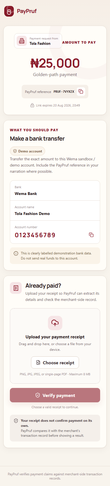
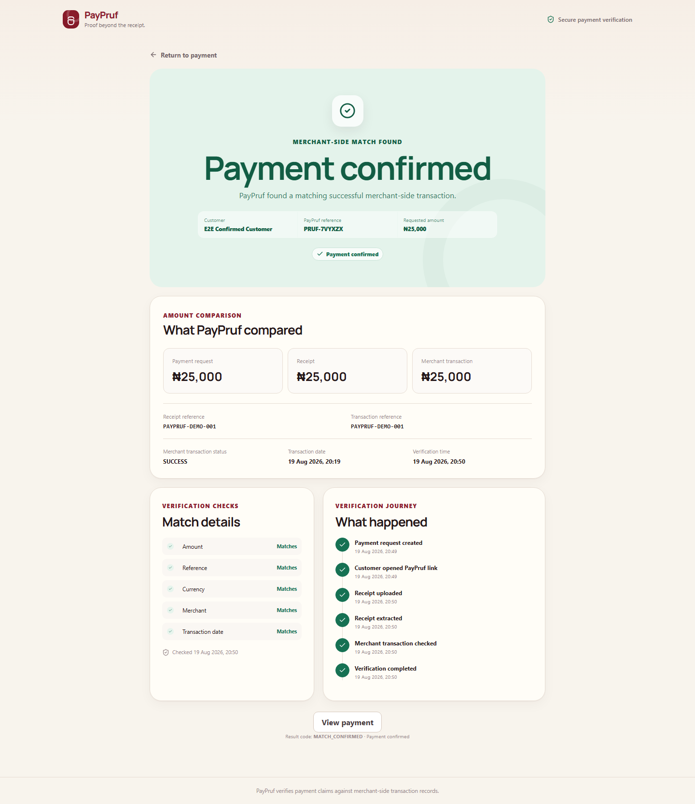

# PayPruf

## Proof beyond the receipt.

PayPruf helps informal merchants turn customer payment claims into structured,
verifiable payment records. A customer uploads a receipt, PayPruf extracts the
transaction details, checks merchant-side Wema sandbox/demo data, and returns a
clear result the merchant can reconcile.

> Receipt extraction is supporting evidence, not the final source of payment
> truth. PayPruf only confirms a payment after a corresponding successful
> merchant-side transaction is found and compared.

## Why it matters

Many small businesses verify transfers by switching between screenshots,
messaging apps, bank notifications, notebooks, and spreadsheets. That manual
process is slow and easy to misunderstand. PayPruf demonstrates a simpler path:
one payment link, a structured receipt record, a merchant-side transaction
check, and a factual verification result.

This Hackaholics 7.0 MVP deliberately focuses on payment verification and
reconciliation. It does not add wallets, lending, credit scoring, inventory, or
an accounting suite.

## Product flow

```text
Merchant creates request -> Customer receives PayPruf link
                         -> Customer transfers and uploads receipt
                         -> Receipt intelligence extracts structured fields
                         -> FastAPI loads the request
                         -> Wema mock checks merchant-side transaction data
                         -> Matching engine compares both sources
                         -> CONFIRMED | PENDING | MISMATCH | NOT_RECEIVED
                         -> Merchant dashboard and payment detail update
```

The five product views are:

1. Merchant Dashboard — payment summary, status filters, and recent payments.
2. Payment Link — merchant preview, demo account details, copy, and WhatsApp
   deep-link sharing.
3. Customer Payment Page — mobile-first payment instructions and receipt upload.
4. Verification Result — clear result, explanation, and comparison evidence.
5. Payment Details — request, receipt extraction, sandbox transaction, and
   verification timeline.

## Architecture

| Layer | Implementation | Responsibility |
| --- | --- | --- |
| Web client | React, TypeScript, Vite, React Router, TanStack Query | Merchant and customer journeys, upload UX, result explanations |
| API | FastAPI, Pydantic | Validation, public-token routes, consistent errors, orchestration |
| Persistence | SQLAlchemy, SQLite | Merchant, requests, receipts, mock transactions, verifications |
| Receipt intelligence | Pillow, PDFium, RapidOCR, ONNX Runtime | Safe image/PDF preparation, real OCR, normalization, field extraction |
| Banking adapter | `WemaTransactionProvider` + deterministic mock | Merchant-side transaction lookup without fabricated live endpoints |
| Matching | Dedicated payment matching service | Evidence comparison, status decision, idempotency, duplicate protection |

The API and serialized types are documented in
[`docs/API_CONTRACT.md`](docs/API_CONTRACT.md).

## Screenshots

The images below were produced by the checked-in Playwright golden-path test
against the real production frontend bundle and a live FastAPI process.

### Merchant dashboard


### Mobile customer payment



### Confirmed verification



## Repository layout

```text
PAYPRUF/
|-- frontend/               React/Vite client and UI tests
|-- backend/                FastAPI app, persistence, provider, matching, tests
|-- ml/                     Receipt extraction, fixture generator, OCR tests
|-- docs/                   Shared contract and demo evidence
|-- .env.example            Safe local configuration template
`-- README.md
```

## Prerequisites

- Python 3.11 or newer (verified locally with Python 3.14)
- Node.js 22 LTS recommended; the current toolchain also supports Node 20 and
  Node 24+ (verified locally with Node 25.9)
- No system Tesseract, Poppler, database server, Wema credential, or WhatsApp
  Business account is required for the deterministic demo

On Windows PowerShell systems where script execution is disabled, use
`npm.cmd` instead of `npm` in the commands below.

## Setup

### Backend

```powershell
python -m venv .venv
.\.venv\Scripts\python.exe -m pip install -r backend\requirements.txt
Copy-Item .env.example .env
.\.venv\Scripts\python.exe -m backend.app.seed --reset
.\.venv\Scripts\python.exe -m uvicorn backend.app.main:app --reload --port 8000
```

macOS/Linux uses the equivalent `.venv/bin/python` path:

```bash
.venv/bin/python -m pip install -r backend/requirements.txt
.venv/bin/python -m backend.app.seed --reset
.venv/bin/python -m uvicorn backend.app.main:app --reload --port 8000
```

The API is available at `http://localhost:8000`; health is
`http://localhost:8000/api/health`.

### Frontend

In a second terminal:

```powershell
cd frontend
npm.cmd install
Copy-Item .env.example .env
npm.cmd run dev
```

Open `http://localhost:5173/dashboard`. Vite proxies `/api` to the local FastAPI
service during development.

This workspace has the Console Ninja VS Code extension installed, which patches
local Vite files while active. If that extension causes a dependency-optimizer
error, pause Console Ninja and restart Vite; the production build/preview path
is not affected.

## Environment variables

| Variable | Default/example | Purpose |
| --- | --- | --- |
| `APP_ENV` | `development` | Runtime mode |
| `DATABASE_URL` | `sqlite:///./backend/data/paypruf.db` | SQLAlchemy database URL |
| `FRONTEND_URL` | `http://localhost:5173` | Allowed browser origin |
| `PUBLIC_APP_URL` | `http://localhost:5173` | Generated customer links |
| `UPLOAD_DIR` | `./backend/data/uploads` | Private receipt storage |
| `MAX_UPLOAD_SIZE_BYTES` | `8388608` | Server upload limit |
| `OCR_PROVIDER` | `rapidocr` | Receipt OCR provider |
| `WEMA_PROVIDER_MODE` | `mock` | Merchant transaction provider mode |
| `LOG_LEVEL` | `INFO` | Backend logging level |
| `VITE_API_BASE_URL` | `/api` | Browser API prefix |

Do not add undocumented Wema URLs or keys. The application intentionally fails
configuration for unsupported provider modes instead of pretending to be live.

## Demo scenarios

Reset the demo before judging:

```powershell
.\.venv\Scripts\python.exe -m backend.app.seed --reset
```

Synthetic fixtures live in `ml/fixtures`. From the dashboard, create or open a
request with the expected amount, open its public link, upload the fixture, and
verify:

| Fixture/reference | Expected request | Mock merchant transaction | Result |
| --- | ---: | ---: | --- |
| `PAYPRUF-DEMO-001` | ₦25,000 | ₦25,000, successful | `CONFIRMED` |
| `PAYPRUF-DEMO-002` | ₦25,000 | ₦20,000, successful | `MISMATCH` |
| `PAYPRUF-DEMO-003` | ₦15,000 | No corresponding transaction | `NOT_RECEIVED` |
| `PAYPRUF-DEMO-004` | ₦30,000 | ₦30,000, pending | `PENDING` |

The receipt reference identifies the bank transaction; the `PRUF-XXXXXX`
reference identifies the PayPruf request. They are intentionally distinct.

## Verification rules

- PayPruf never confirms by receipt appearance or amount alone.
- Candidate discovery requires a strong provider reference or exact request
  narration link, scoped to the merchant and time window.
- A missing merchant transaction returns `NOT_RECEIVED`.
- An unsettled merchant transaction returns `PENDING`.
- Material amount, currency, reference, or merchant contradictions return
  `MISMATCH` using factual, non-accusatory language.
- Only a uniquely identified, successful merchant transaction with consistent
  evidence returns `CONFIRMED`.
- A transaction cannot confirm two different requests; rechecking the same
  payment is idempotent.

## Tests and quality checks

Backend and receipt intelligence:

```powershell
.\.venv\Scripts\python.exe -m pytest backend\tests ml\tests -q
.\.venv\Scripts\python.exe -m ruff check backend ml e2e
```

Frontend:

```powershell
cd frontend
npm.cmd run test:run
npm.cmd run typecheck
npm.cmd run lint
npm.cmd run build
npm.cmd audit
cd ..
```

Browser golden path (first install its optional browser dependency):

```powershell
.\.venv\Scripts\python.exe -m pip install -r e2e\requirements.txt
.\.venv\Scripts\python.exe -m playwright install chromium
.\.venv\Scripts\python.exe -m pytest e2e -q -s
```

The browser test starts an isolated FastAPI database, builds and serves the real
frontend, creates a payment, uploads the confirmed receipt, verifies it, checks
the updated dashboard, asserts desktop/mobile overflow behavior, rejects browser
console errors, and refreshes the screenshots above.

Final local regression results:

| Check | Result |
| --- | --- |
| Backend API, matching, upload, idempotency, privacy/logging tests | 18 passed |
| Receipt parser/service and real PNG/JPEG/PDF OCR tests | 13 passed |
| Frontend component and utility tests | 13 passed |
| Playwright live golden path | 1 passed |
| Ruff, TypeScript, ESLint, Vite production build | Passed |
| Full npm production and development advisory audit | 0 vulnerabilities |

## Wema integration status

This repository uses a deterministic **Wema Sandbox / Demo Environment mock**
behind a provider interface. The supplied specification contains no live or
sandbox endpoint contract and no credentials, so no API URL, payload, header,
or key has been invented. A documented Wema adapter can replace the mock later
without changing the UI or matching service.

## Receipt intelligence

Receipt processing is isolated from payment authorization:

```text
validated PNG/JPEG/PDF
-> bounded image preparation / first-page PDF rendering
-> OCR provider
-> normalized text
-> structured amount/reference/date/bank/name fields
-> matching service (separate step)
```

Uploads are size-limited and checked by extension, declared MIME type, file
signature, and decoder. Server-generated filenames are stored outside the
frontend's public directory. OCR failures return an actionable error and do not
change a payment to confirmed.

## Known MVP limitations

- Single seeded demo merchant; merchant authentication and tenancy are future
  production work.
- Deterministic local Wema data, not a live bank connection.
- Single-page receipt PDFs are supported for this hackathon scope.
- OCR quality depends on image clarity; low-confidence or missing fields are
  surfaced and never treated as proof.
- WhatsApp sharing is a standard prefilled deep link, not a WhatsApp Business
  integration or chatbot.

## Roadmap

- Documented Wema sandbox/live adapter and automatic transaction monitoring
- WhatsApp-native merchant assistant and customer payment reminders
- Automatic reconciliation without mandatory receipt upload
- Merchant financial summaries and portable digital transaction history
- Carefully scoped multi-bank provider support
